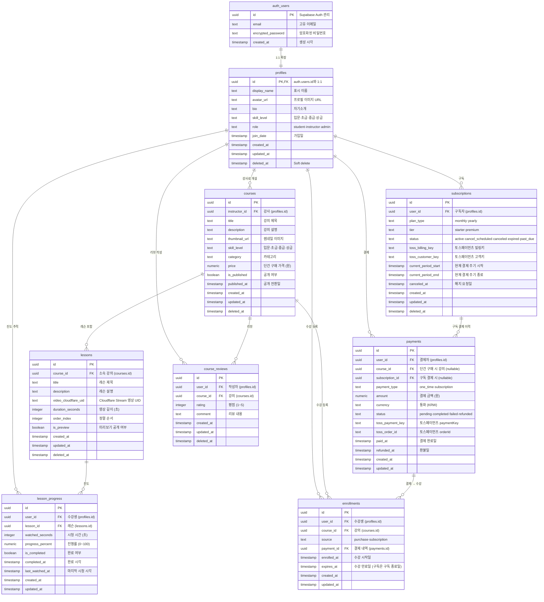

# Surftorial — 데이터 모델 설계서 v1.0

> 서핑 온라인 강좌 플랫폼 | Data Model & ERD
> 작성일: 2025-06-17 | 작성자: senior-engineer

---

## 1. ERD (Entity Relationship Diagram)



---

## 2. 테이블별 상세 정의

### 2.1 `profiles` — 사용자 프로필

| 컬럼 | 타입 | 제약 | 설명 |
|------|------|------|------|
| `id` | UUID | PK, FK → auth.users.id | Supabase Auth와 1:1. 트리거로 자동 생성 |
| `display_name` | TEXT | NOT NULL, CHECK(length ≥ 2) | 닉네임/실명 |
| `avatar_url` | TEXT | — | Supabase Storage 프로필 이미지 경로 |
| `bio` | TEXT | — | 자기소개 (최대 500자) |
| `skill_level` | TEXT | NOT NULL, DEFAULT 'beginner', CHECK IN ('beginner','intermediate','advanced','expert') | 서핑 실력 레벨 |
| `role` | TEXT | NOT NULL, DEFAULT 'student', CHECK IN ('student','instructor','admin') | 사용자 역할 |
| `join_date` | TIMESTAMPTZ | NOT NULL, DEFAULT now() | 가입일 |
| `created_at` | TIMESTAMPTZ | NOT NULL, DEFAULT now() | — |
| `updated_at` | TIMESTAMPTZ | NOT NULL, DEFAULT now() | — |
| `deleted_at` | TIMESTAMPTZ | — | Soft delete 타임스탬프 |

**인덱스:**
- `idx_profiles_role` ON (role) — 역할별 필터링 (관리자 대시보드)
- `idx_profiles_display_name` ON (display_name) — 검색

**Supabase 트리거:**
```sql
-- auth.users 생성 시 profiles 자동 삽입
CREATE OR REPLACE FUNCTION public.handle_new_user()
RETURNS TRIGGER AS $$
BEGIN
  INSERT INTO public.profiles (id, display_name)
  VALUES (NEW.id, COALESCE(NEW.raw_user_meta_data->>'display_name', split_part(NEW.email, '@', 1)));
  RETURN NEW;
END;
$$ LANGUAGE plpgsql SECURITY DEFINER;

CREATE TRIGGER on_auth_user_created
  AFTER INSERT ON auth.users
  FOR EACH ROW EXECUTE FUNCTION public.handle_new_user();
```

---

### 2.2 `courses` — 강의

| 컬럼 | 타입 | 제약 | 설명 |
|------|------|------|------|
| `id` | UUID | PK, DEFAULT gen_random_uuid() | — |
| `instructor_id` | UUID | NOT NULL, FK → profiles.id | 강사 |
| `title` | TEXT | NOT NULL, CHECK(length ≥ 2) | 강의 제목 |
| `description` | TEXT | — | 강의 설명 (마크다운 지원) |
| `thumbnail_url` | TEXT | — | Supabase Storage 썸네일 경로 |
| `skill_level` | TEXT | NOT NULL, DEFAULT 'beginner', CHECK IN ('beginner','intermediate','advanced','expert') | 난이도 |
| `category` | TEXT | NOT NULL, CHECK IN ('basics','popup','turn','safety','seasonal','fitness') | 카테고리 (입문/팝업/턴/안전/시즌/피트니스) |
| `price` | NUMERIC(10,0) | NOT NULL, DEFAULT 0, CHECK(price ≥ 0) | 단건 구매 가격 (원). 0 = 구독 전용 |
| `is_published` | BOOLEAN | NOT NULL, DEFAULT false | 공개 여부 (임시저장 지원) |
| `published_at` | TIMESTAMPTZ | — | 최초 공개일 |
| `created_at` | TIMESTAMPTZ | NOT NULL, DEFAULT now() | — |
| `updated_at` | TIMESTAMPTZ | NOT NULL, DEFAULT now() | — |
| `deleted_at` | TIMESTAMPTZ | — | Soft delete |

**인덱스:**
- `idx_courses_instructor` ON (instructor_id) — 강사별 강의 조회
- `idx_courses_published` ON (is_published, published_at DESC) WHERE deleted_at IS NULL — 공개 강의 목록
- `idx_courses_category` ON (category, skill_level) — 카테고리·레벨 필터
- `idx_courses_price` ON (price) WHERE price > 0 — 유료 강의 검색

**제약:**
```sql
-- published_at 자동 설정 트리거
CREATE OR REPLACE FUNCTION public.set_published_at()
RETURNS TRIGGER AS $$
BEGIN
  IF NEW.is_published = true AND OLD.is_published = false THEN
    NEW.published_at = now();
  END IF;
  RETURN NEW;
END;
$$ LANGUAGE plpgsql;
```

---

### 2.3 `lessons` — 레슨

| 컬럼 | 타입 | 제약 | 설명 |
|------|------|------|------|
| `id` | UUID | PK, DEFAULT gen_random_uuid() | — |
| `course_id` | UUID | NOT NULL, FK → courses.id ON DELETE CASCADE | 소속 강의 |
| `title` | TEXT | NOT NULL | 레슨 제목 |
| `description` | TEXT | — | 레슨 설명 |
| `video_cloudflare_uid` | TEXT | NOT NULL | Cloudflare Stream 비디오 UID |
| `duration_seconds` | INTEGER | NOT NULL, DEFAULT 0, CHECK(duration_seconds ≥ 0) | 영상 길이 (초) |
| `order_index` | INTEGER | NOT NULL, DEFAULT 0 | 정렬 순서 (0부터 시작) |
| `is_preview` | BOOLEAN | NOT NULL, DEFAULT false | 미리보기 공개 여부 (비로그인 사용자도 시청 가능) |
| `created_at` | TIMESTAMPTZ | NOT NULL, DEFAULT now() | — |
| `updated_at` | TIMESTAMPTZ | NOT NULL, DEFAULT now() | — |
| `deleted_at` | TIMESTAMPTZ | — | Soft delete |

**인덱스:**
- `idx_lessons_course_order` ON (course_id, order_index) — 강의 내 레슨 정렬
- `idx_lessons_video_uid` ON (video_cloudflare_uid) — 영상 UID 조회
- `idx_lessons_preview` ON (course_id, is_preview) WHERE is_preview = true — 미리보기 레슨 조회

**제약:**
```sql
-- 동일 course 내 order_index 유니크
UNIQUE (course_id, order_index) WHERE deleted_at IS NULL;
```

---

### 2.4 `lesson_progress` — 레슨 진도

| 컬럼 | 타입 | 제약 | 설명 |
|------|------|------|------|
| `id` | UUID | PK, DEFAULT gen_random_uuid() | — |
| `user_id` | UUID | NOT NULL, FK → profiles.id | 수강생 |
| `lesson_id` | UUID | NOT NULL, FK → lessons.id ON DELETE CASCADE | 레슨 |
| `watched_seconds` | INTEGER | NOT NULL, DEFAULT 0, CHECK(watched_seconds ≥ 0) | 누적 시청 시간 (초) |
| `progress_percent` | NUMERIC(5,2) | NOT NULL, DEFAULT 0, CHECK(progress_percent BETWEEN 0 AND 100) | 진행률 |
| `is_completed` | BOOLEAN | NOT NULL, DEFAULT false | 완료 여부 (progress_percent ≥ 90% 시 true) |
| `completed_at` | TIMESTAMPTZ | — | 완료 처리 시각 |
| `last_watched_at` | TIMESTAMPTZ | NOT NULL, DEFAULT now() | 마지막 시청 시각 |
| `created_at` | TIMESTAMPTZ | NOT NULL, DEFAULT now() | — |
| `updated_at` | TIMESTAMPTZ | NOT NULL, DEFAULT now() | — |

**인덱스:**
- `idx_progress_user_lesson` UNIQUE ON (user_id, lesson_id) — 한 사용자·레슨당 1행
- `idx_progress_user_course` ON (user_id) — 내 진도 전체 조회 (JOIN으로 course 필터)
- `idx_progress_completed` ON (user_id, is_completed) — 완료 레슨 카운트

**제약:**
```sql
-- 진도 90% 이상 시 자동 완료 처리
-- 앱 레벨에서 처리 (UPSERT 시 progress_percent ≥ 90이면 is_completed = true, completed_at = now())
```

---

### 2.5 `subscriptions` — 구독

| 컬럼 | 타입 | 제약 | 설명 |
|------|------|------|------|
| `id` | UUID | PK, DEFAULT gen_random_uuid() | — |
| `user_id` | UUID | NOT NULL, FK → profiles.id | 구독자 |
| `plan_type` | TEXT | NOT NULL, CHECK IN ('monthly','yearly') | 결제 주기 |
| `tier` | TEXT | NOT NULL, CHECK IN ('starter','premium') | 구독 등급 |
| `status` | TEXT | NOT NULL, DEFAULT 'active', CHECK IN ('active','cancel_scheduled','canceled','expired','past_due') | 구독 상태 |
| `toss_billing_key` | TEXT | NOT NULL, UNIQUE | 토스페이먼츠 빌링키 (정기결제용) |
| `toss_customer_key` | TEXT | NOT NULL | 토스페이먼츠 고객키 |
| `current_period_start` | TIMESTAMPTZ | NOT NULL | 현재 결제 주기 시작 |
| `current_period_end` | TIMESTAMPTZ | NOT NULL | 현재 결제 주기 종료 |
| `canceled_at` | TIMESTAMPTZ | — | 해지 요청일 (기말까지 유지) |
| `created_at` | TIMESTAMPTZ | NOT NULL, DEFAULT now() | — |
| `updated_at` | TIMESTAMPTZ | NOT NULL, DEFAULT now() | — |
| `deleted_at` | TIMESTAMPTZ | — | Soft delete |

**인덱스:**
- `idx_subscriptions_user` ON (user_id, status) — 내 구독 조회
- `idx_subscriptions_billing_key` UNIQUE ON (toss_billing_key) — 토스페이먼츠 웹훅 매핑
- `idx_subscriptions_customer_key` ON (toss_customer_key) — 고객키별 구독 조회
- `idx_subscriptions_expiring` ON (current_period_end) WHERE status = 'active' — 만료 예정 구독

**제약:**
```sql
-- 사용자당 활성 구독 1개 제한 (부분 인덱스)
UNIQUE (user_id) WHERE status = 'active' AND deleted_at IS NULL;
```

> **설계 결정 — 토스페이먼츠 키 저장**: 토스페이먼츠 빌링키(Billing Key)와 고객키(Customer Key)를 평문으로 저장합니다. 빌링키는 정기결제 승인, 고객키는 구독자 식별을 위해 웹훅에서 조회해야 하는 식별자이며, 민감한 결제 정보(카드번호 등)는 토스페이먼츠 서버에만 저장됩니다. 토스페이먼츠 위젯/Checkout을 통해 생성되므로 안전합니다.

---

### 2.6 `payments` — 결제 내역

| 컬럼 | 타입 | 제약 | 설명 |
|------|------|------|------|
| `id` | UUID | PK, DEFAULT gen_random_uuid() | — |
| `user_id` | UUID | NOT NULL, FK → profiles.id | 결제자 |
| `course_id` | UUID | FK → courses.id | 단건 구매 시 강의 (구독 결제는 NULL) |
| `subscription_id` | UUID | FK → subscriptions.id | 구독 결제 시 구독 (단건 결제는 NULL) |
| `payment_type` | TEXT | NOT NULL, CHECK IN ('one_time','subscription') | 결제 유형 |
| `amount` | NUMERIC(12,0) | NOT NULL, CHECK(amount > 0) | 결제 금액 (원) |
| `currency` | TEXT | NOT NULL, DEFAULT 'KRW' | 통화 |
| `status` | TEXT | NOT NULL, DEFAULT 'pending', CHECK IN ('pending','completed','failed','refunded') | 결제 상태 |
| `toss_payment_key` | TEXT | — | 토스페이먼츠 paymentKey (멱등키) |
| `toss_order_id` | TEXT | — | 토스페이먼츠 orderId (주문번호) |
| `paid_at` | TIMESTAMPTZ | — | 결제 완료 시각 |
| `refunded_at` | TIMESTAMPTZ | — | 환불 시각 |
| `created_at` | TIMESTAMPTZ | NOT NULL, DEFAULT now() | — |
| `updated_at` | TIMESTAMPTZ | NOT NULL, DEFAULT now() | — |

**인덱스:**
- `idx_payments_user` ON (user_id, created_at DESC) — 내 결제 내역
- `idx_payments_course` ON (course_id) — 강의별 결제 내역 (매출 분석)
- `idx_payments_status` ON (status, created_at DESC) — 결제 상태별 조회
- `idx_payments_payment_key` UNIQUE ON (toss_payment_key) WHERE toss_payment_key IS NOT NULL — 토스페이먼츠 웹훅 멱등키
- `idx_payments_order_id` ON (toss_order_id) — 주문번호 조회

**제약:**
```sql
-- 결제 유형에 따른 NULL 제약
CHECK (
  (payment_type = 'one_time' AND course_id IS NOT NULL AND subscription_id IS NULL) OR
  (payment_type = 'subscription' AND subscription_id IS NOT NULL AND course_id IS NULL)
);
```

---

### 2.7 `enrollments` — 수강 등록

| 컬럼 | 타입 | 제약 | 설명 |
|------|------|------|------|
| `id` | UUID | PK, DEFAULT gen_random_uuid() | — |
| `user_id` | UUID | NOT NULL, FK → profiles.id | 수강생 |
| `course_id` | UUID | NOT NULL, FK → courses.id | 강의 |
| `source` | TEXT | NOT NULL, CHECK IN ('purchase','subscription') | 수강 경로 |
| `payment_id` | UUID | FK → payments.id | 결제 내역 (추적용) |
| `enrolled_at` | TIMESTAMPTZ | NOT NULL, DEFAULT now() | 수강 시작일 |
| `expires_at` | TIMESTAMPTZ | — | 만료일 (구독: 구독 종료일, 단건: NULL=영구) |
| `created_at` | TIMESTAMPTZ | NOT NULL, DEFAULT now() | — |
| `updated_at` | TIMESTAMPTZ | NOT NULL, DEFAULT now() | — |

**인덱스:**
- `idx_enrollments_user_course` UNIQUE ON (user_id, course_id) — 사용자·강의당 1건
- `idx_enrollments_expires` ON (expires_at) WHERE expires_at IS NOT NULL — 만료 처리 배치

**제약:**
```sql
-- 단건 구매는 만료일 없음 (영구), 구독은 만료일 필수
CHECK (
  (source = 'purchase' AND expires_at IS NULL) OR
  (source = 'subscription' AND expires_at IS NOT NULL)
);
```

---

### 2.8 `course_reviews` — 강의 리뷰

| 컬럼 | 타입 | 제약 | 설명 |
|------|------|------|------|
| `id` | UUID | PK, DEFAULT gen_random_uuid() | — |
| `user_id` | UUID | NOT NULL, FK → profiles.id | 작성자 |
| `course_id` | UUID | NOT NULL, FK → courses.id | 강의 |
| `rating` | INTEGER | NOT NULL, CHECK(rating BETWEEN 1 AND 5) | 평점 (1~5) |
| `comment` | TEXT | — | 리뷰 내용 |
| `created_at` | TIMESTAMPTZ | NOT NULL, DEFAULT now() | — |
| `updated_at` | TIMESTAMPTZ | NOT NULL, DEFAULT now() | — |
| `deleted_at` | TIMESTAMPTZ | — | Soft delete |

**인덱스:**
- `idx_reviews_user_course` UNIQUE ON (user_id, course_id) WHERE deleted_at IS NULL — 사용자당 1개 리뷰
- `idx_reviews_course` ON (course_id, created_at DESC) — 강의별 리뷰 (최신순)
- `idx_reviews_rating` ON (course_id, rating) — 평점 통계

---

## 3. RLS (Row Level Security) 정책

Supabase RLS를 기반으로 모든 테이블에 대해 행 수준 접근 제어를 적용합니다.

### 3.1 공통 원칙

- **모든 테이블**: RLS 활성화 필수 (`ALTER TABLE ... ENABLE ROW LEVEL SECURITY`)
- **인증되지 않은 사용자**: 공개 강의 목록만 조회 가능
- **Soft delete**: `deleted_at IS NULL` 조건을 모든 쿼리에 적용

### 3.2 테이블별 RLS 정책

#### `profiles`

| 정책명 | 대상 | 권한 | 조건 |
|--------|------|------|------|
| `profiles_select_public` | anon, authenticated | SELECT | `role = 'instructor' AND deleted_at IS NULL` — 강사 프로필은 공개 |
| `profiles_select_own` | authenticated | SELECT | `id = auth.uid()` — 자신의 프로필만 |
| `profiles_update_own` | authenticated | UPDATE | `id = auth.uid()` — 자신의 프로필만 수정 |
| `profiles_insert_own` | authenticated | INSERT | `id = auth.uid()` — 가입 시 본인 프로필 생성 |
| `profiles_admin_all` | admin 역할 | ALL | `EXISTS (SELECT 1 FROM profiles WHERE id = auth.uid() AND role = 'admin')` |

#### `courses`

| 정책명 | 대상 | 권한 | 조건 |
|--------|------|------|------|
| `courses_select_published` | anon, authenticated | SELECT | `is_published = true AND deleted_at IS NULL` — 공개 강의만 |
| `courses_select_instructor` | authenticated (강사) | SELECT | `instructor_id = auth.uid()` — 자신이 만든 강의 |
| `courses_insert_instructor` | authenticated (강사 이상) | INSERT | `instructor_id = auth.uid()` — 강사가 강의 생성 |
| `courses_update_instructor` | authenticated (강사) | UPDATE | `instructor_id = auth.uid()` — 자신의 강의만 수정 |
| `courses_admin_all` | admin 역할 | ALL | 관리자 전체 권한 |

#### `lessons`

| 정책명 | 대상 | 권한 | 조건 |
|--------|------|------|------|
| `lessons_select_published` | authenticated | SELECT | 강의가 공개 상태 (`EXISTS (SELECT 1 FROM courses WHERE id = lesson.course_id AND is_published = true)`) |
| `lessons_select_instructor` | authenticated (강사) | SELECT | `EXISTS (SELECT 1 FROM courses WHERE id = lessons.course_id AND instructor_id = auth.uid())` |
| `lessons_modify_instructor` | authenticated (강사) | INSERT, UPDATE, DELETE | 자신의 강의에 포함된 레슨만 |

#### `lesson_progress`

| 정책명 | 대상 | 권한 | 조건 |
|--------|------|------|------|
| `progress_select_own` | authenticated | SELECT | `user_id = auth.uid()` — 자신의 진도만 |
| `progress_insert_own` | authenticated | INSERT | `user_id = auth.uid()` |
| `progress_update_own` | authenticated | UPDATE | `user_id = auth.uid()` |
| `progress_select_instructor` | authenticated (강사) | SELECT | 자신의 강의에 등록된 학생의 진도 |
| `progress_admin` | admin 역할 | ALL | 관리자 전체 권한 |

#### `subscriptions`

| 정책명 | 대상 | 권한 | 조건 |
|--------|------|------|------|
| `subscriptions_select_own` | authenticated | SELECT | `user_id = auth.uid()` — 자신의 구독만 |
| `subscriptions_insert_own` | authenticated | INSERT | `user_id = auth.uid()` — 서버 사이드에서 생성 (토스페이먼츠 웹훅) |
| `subscriptions_update_own` | authenticated | UPDATE | `user_id = auth.uid()` — 상태 변경은 서버 사이드만 |
| `subscriptions_admin` | admin 역할 | ALL | 관리자 전체 권한 |

#### `payments`

| 정책명 | 대상 | 권한 | 조건 |
|--------|------|------|------|
| `payments_select_own` | authenticated | SELECT | `user_id = auth.uid()` — 자신의 결제 내역만 |
| `payments_insert_service` | service_role | INSERT | 토스페이먼츠 웹훅에서만 생성 (클라이언트 직접 INSERT 금지) |
| `payments_update_service` | service_role | UPDATE | 상태 변경은 토스페이먼츠 웹훅만 |
| `payments_admin` | admin 역할 | SELECT | 관리자 조회 가능 |

#### `enrollments`

| 정책명 | 대상 | 권한 | 조건 |
|--------|------|------|------|
| `enrollments_select_own` | authenticated | SELECT | `user_id = auth.uid()` — 자신의 수강 목록 |
| `enrollments_insert_service` | service_role | INSERT | 결제 완료 후 서버 사이드에서만 생성 |
| `enrollments_update_service` | service_role | UPDATE | 만료 처리 등 서버 사이드만 |
| `enrollments_select_instructor` | authenticated (강사) | SELECT | 자신의 강의에 등록된 수강생 목록 |
| `enrollments_admin` | admin 역할 | ALL | 관리자 전체 권한 |

#### `course_reviews`

| 정책명 | 대상 | 권한 | 조건 |
|--------|------|------|------|
| `reviews_select_public` | anon, authenticated | SELECT | `deleted_at IS NULL` — 리뷰는 공개 |
| `reviews_insert_own` | authenticated | INSERT | `user_id = auth.uid()` — 수강생 리뷰 작성 |
| `reviews_update_own` | authenticated | UPDATE | `user_id = auth.uid()` — 자신의 리뷰만 수정 |
| `reviews_delete_own` | authenticated | DELETE | `user_id = auth.uid()` — 자신의 리뷰만 삭제 (soft delete) |

---

## 4. 데이터 흐름

### 4.1 결제 → 수강 등록 흐름 (단건 구매)

```
사용자 "구매" 클릭
  │
  ▼
[Next.js] 토스페이먼츠 결제위젯 → 결제 요청
  │  ← course_id, user_id, amount, orderId 생성
  ▼
[토스페이먼츠] 결제창 → 사용자 인증/결제
  │
  ▼ (결제 승인 완료)
[토스페이먼츠 Webhook] PAYMENT_CONFIRM
  │
  ▼
[Next.js API Route] 웹훅 핸들러 (/api/webhooks/toss)
  │  1. Toss-Signature 헤더 검증 (HMAC-SHA256)
  │  2. toss_order_id로 중복 수신 방지 (멱등 처리)
  │  3. payments INSERT (status = 'completed', toss_payment_key, toss_order_id)
  │  4. enrollments INSERT (source = 'purchase', expires_at = NULL → 영구)
  │
  ▼
[클라이언트] 성공 페이지 리다이렉트 → 수강 시작
```

### 4.2 결제 → 수강 등록 흐름 (구독)

```
사용자 "구독" 클릭
  │
  ▼
[Next.js] 토스페이먼츠 빌링키 발급 → 정기결제 요청
  │  ← plan(tier, cycle), user_id, customerKey 생성
  ▼
[토스페이먼츠] 결제창 → 빌링키 발급 + 초회 결제
  │
  ▼ (초회 결제 완료)
[토스페이먼츠 Webhook] SUBSCRIPTION_BILLING
  │
  ▼
[Next.js API Route] 웹훅 핸들러 (/api/webhooks/toss)
  │  1. Toss-Signature 헤더 검증 (HMAC-SHA256)
  │  2. toss_order_id로 중복 수신 방지 (멱등 처리)
  │  3. subscriptions INSERT (status = 'active', toss_billing_key, toss_customer_key)
  │  4. payments INSERT (초회 결제, payment_type = 'subscription')
  │  5. enrollments INSERT (source = 'subscription', expires_at = current_period_end)
  │     ← 구독으로 접근 가능한 모든 공개 강의에 대해 등록
  │
  ▼ (매월/매년 정기 결제)
[토스페이먼츠 Webhook] SUBSCRIPTION_BILLING
  │
  ▼
[Next.js] subscriptions.current_period_end 연장
  │  enrollments.expires_at 연장
  │
  ▼ (구독 해지 요청)
[토스페이먼츠 Webhook] SUBSCRIPTION_CANCEL
  │
  ▼
[Next.js] subscriptions.status = 'cancel_scheduled'
  │  enrollments.expires_at = now() (구독 수강 종료)
```

### 4.3 영상 시청 → 진도 추적 흐름

```
사용자가 레슨 영상 시청
  │
  ▼
[Vidstack Player] timeupdate 이벤트 (5초 간격)
  │
  ▼
[Next.js API Route] UPSERT lesson_progress
  │  watched_seconds += delta
  │  progress_percent = (watched_seconds / lesson.duration_seconds) * 100
  │  IF progress_percent >= 90 → is_completed = true, completed_at = now()
  │
  ▼
[클라이언트] 진도 바 업데이트, 완료 뱃지 표시
```

### 4.4 구독 만료 처리 (배치)

```
[Supabase pg_cron] 매일 00:00 KST 실행
  │
  ▼
만료된 구독 처리:
  │  subscriptions WHERE current_period_end < now() AND status = 'active'
  │  → UPDATE status = 'expired'
  │  → UPDATE enrollments.expires_at = now() WHERE source = 'subscription'
  │
  ▼
토스페이먼츠 동기화 확인:
  │  만료된 구독 중 토스페이먼츠 billingKey 상태가 활성이면 → 웹훅 누락 가능성
  │  → 관리자 알림
```

---

## 5. 확장 고려사항

### 5.1 파티셔닝 전략

| 테이블 | 전략 | 시점 | 기준 |
|--------|------|------|------|
| `payments` | 월별 RANGE 파티셔닝 | 결제 건수 > 100만 건 | `created_at` 기준 월 단위 |
| `lesson_progress` | user_id 기준 HASH 파티셔닝 | 사용자 > 10만 명 | 읽기 부하 분산 |

### 5.2 캐싱 레이어

| 데이터 | 캐시 전략 | TTL | 비고 |
|--------|----------|-----|------|
| 공개 강의 목록 | Vercel Edge Config (ISR) | 60초 | `revalidate = 60` |
| 강의 상세 | ISR + 온디맨드 리검증 | 변경 시 무효화 | Supabase Realtime 트리거 |
| 강사 프로필 | Vercel Edge Config | 300초 | 자주 변경되지 않음 |
| 수강 진도 | 클라이언트 상태 (Zustand) | 세션 내 캐시 | 서버와 5초 간격 동기화 |
| 리뷰 평점 통계 | DB Materialized View | 1시간 | `REFRESH MATERIALIZED VIEW` |

### 5.3 향후 확장 테이블 (MVP 이후)

| 테이블 | 설명 | 시점 |
|--------|------|------|
| `analytics_events` | page_view, video_watch, purchase 등 이벤트 로깅 | Phase 2 |
| `coupons` | 할인 쿠폰 (코드, 할인율, 만료일, 사용 제한) | Phase 2 |
| `video_feedback` | 프리미엄 코치 영상 피드백 (S3 영상 URL, 코멘트) | Phase 2 |
| `lesson_attachments` | 레슨별 첨부자료 (PDF, 이미지 등 Supabase Storage 경로, file_type, display_order) | Phase 2 |
| `notifications` | 알림 (결제 완료, 구독 만료 임박, 새 강의) | Phase 2 |
| `chat_messages` | 코치 Q&A 채팅 (Supabase Realtime 기반) | Phase 3 |
| `b2b_partners` | 서핑 스쿨 파트너 정보, 수익 공유 비율 | Phase 3 |
| `partner_courses` | 파트너 전용 강의 (수익 배분 대상) | Phase 3 |

### 5.4 Prisma 스키마 변환 시 유의사항

- `auth.users`는 Supabase 관리 테이블이므로 Prisma schema에 선언하지 않습니다. `profiles`만 정의하고 `@@id`를 수동 관리합니다.
- `deleted_at` 필드는 Prisma의 `@@ignore`가 아닌 앱 레벨 글로벌 필터로 처리합니다 (`middleware` 또는 `client.$extends`).
- Supabase RLS는 Prisma 쿼리에 자동 적용되지만, `service_role` 키를 사용하는 서버 사이드 로직(webhook, 배치)은 RLS를 우회하므로 주의가 필요합니다.
- UUID는 `@default(uuid())` (Prisma 6.x) 또는 `@default(dbgenerated("gen_random_uuid()"))`를 사용합니다.
- `NUMERIC(10,0)` 가격 필드는 Prisma에서 `Decimal` 타입으로 매핑됩니다. 앱에서는 항상 원 단위 정수로 취급합니다.

---

## 6. 요약: 테이블 관계 매핑

```
auth.users (Supabase 관리)
  │
  └── 1:1 ── profiles
                │
                ├── 1:N ── courses (강사로 개설)
                ├── 1:N ── lesson_progress (수강 진도)
                ├── 1:N ── subscriptions (구독)
                ├── 1:N ── payments (결제)
                ├── 1:N ── enrollments (수강 등록)
                └── 1:N ── course_reviews (리뷰)

courses
  ├── 1:N ── lessons
  ├── 1:N ── enrollments
  └── 1:N ── course_reviews

lessons
  └── 1:N ── lesson_progress

subscriptions
  └── 1:N ── payments

payments
  └── 1:N ── enrollments
```

---

*본 문서는 Surftorial MVP 데이터 모델의 초안입니다. Prisma 스키마 구현 시 이 문서를 기반으로 작성하며, 구현 단계에서 필드 추가/수정이 발생할 수 있습니다.*